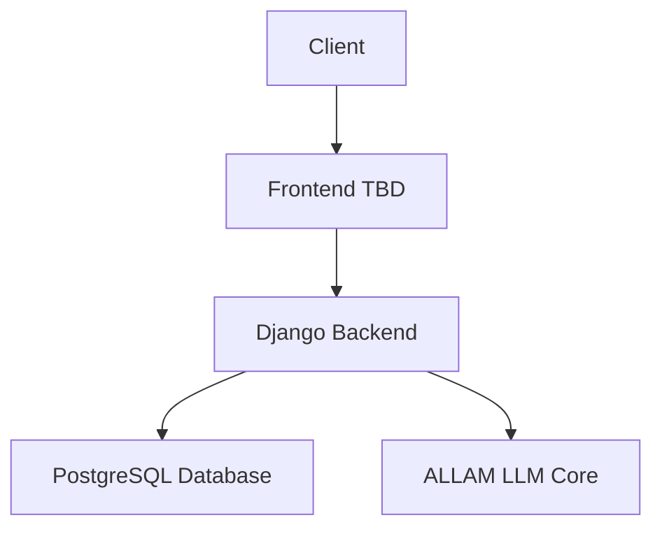

# 🌐 Atlas Innovator ALLAM LLM

## 🚀 Charting New Territories in Language Intelligence

Welcome to the Atlas Innovator ALLAM LLM project – where we're mapping the future of language models!

ICEBOX 1 : LOGO

TO DO 1 : Architecture


## 🧠 Project Overview

Atlas Innovator ALLAM LLM is a cutting-edge Language Learning Model project that aims to push the boundaries of natural language processing and generation. Our monorepo houses both the powerful Django backend and an innovative frontend (TBD), creating a seamless ecosystem for language intelligence.

## 🌟 Key Features

- 🐍 Robust Django Backend
- 🎨 Dynamic Frontend (Coming Soon!)
- 🏭 Factory Pattern for Scalable Data Creation
- 🔄 Seamless Integration Between Components

## 🏗️ Architecture



## 🧑‍💻 The Innovators Behind Atlas

- **Hicham Moughraoui** - _Language Model Architect_
- **Ibrahim Lahlou** - _ML_Backend Sorcerer_
- **Othman Moussaoui** - _Prompt Data Whisperer_
- **Ismail Hamdach** - _Frontend Visionary_

## 🗺️ Repository Landscape

```
atlas-innovator-allam-llm/
├── 🏛️ backend/
│   ├── family_project/
│   │   ├── family/
│   │   ├── family_project/
│   │   ├── manage.py
│   │   └── requirements.txt
│   └── Dockerfile
├── 🎨 frontend/
│   └── [Exciting developments coming soon!]
├── 📚 docs/
├── 🛠️ scripts/
└── 📜 README.md
```

## 🚀 Getting Started

### Backend Expedition
1. Navigate to the backend territory:
   ```
   cd backend
   ```
2. Set up your environment (see `backend/README.md` for the full map)

### Frontend Adventure
Stay tuned for our frontend reveal! It's going to be revolutionary!

## 🧪 Experimentation

- Backend trials: `python manage.py test`
- Frontend experiments: [Our scientists are still working on it!]

## 🚢 Deployment

- Backend deployment: Docker is our vessel of choice. Set sail with our Dockerfile!
- Frontend launch: [Countdown to liftoff has begun!]

## 🤝 Join the Innovation

1. Fork the repository
2. Create your feature branch (`git checkout -b feature/InnovativeIdea`)
3. Commit your breakthroughs (`git commit -m 'Add some InnovativeIdea'`)
4. Push to the branch (`git push origin feature/InnovativeIdea`)
5. Open a Pull Request and let's innovate together!

## 📜 License

This project is licensed under the [MIT License](https://opensource.org/licenses/MIT) - see the [LICENSE.md](LICENSE.md) file for details.

---

<p align="center">
  <i>Atlas Innovator ALLAM LLM - Let's learn all arabic !</i>
</p>
